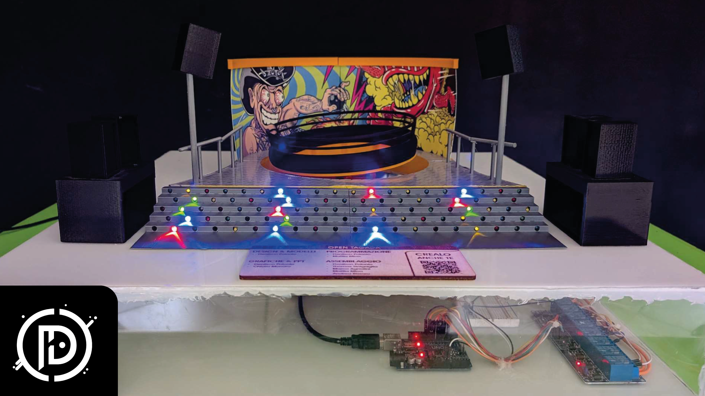

# OPEN TAGADÀ | GUIDE

### Basic Requirements
- Computer with [python](https://www.python.org) and [processing](https://processing.org/) installed
- 3D printer or rely on an online service
- Hot glue
- Tools for cutting plexiglass (or heat a utility knife)
 

| | MATERIALI |
|-------------|-----------|
| 3D MODELS | [download](https://cults3d.com/en/3d-model/architecture/open-tagada) |
| ARDUINO UNO | [amazon](https://amzn.eu/d/0O53TD6) |
| POWER SUPPLY 12v/5v 4A | [amazon](https://amzn.eu/d/ekmAp1X) |
| STROBE/WHITE LED 12v | |
| AIR PUMP 12v | [amazon](https://amzn.eu/d/i67ArNd) |
| SMALL TUBES | |
| SERVOMOTOR 5v | [amazon](https://amzn.eu/d/1QBp1nV) |
| ARDUINO CABLES | [amazon](https://amzn.eu/d/gUC4ACc) |
| BREADBOARD | [amazon](https://amzn.eu/d/g0E0IIw) |
| POWER CABLES | [amazon](https://amzn.eu/d/3s9BbMa) |
| TERMINAL BLOCKS | [amazon](https://amzn.eu/d/3s9BbMa) |
| PLEXIGLASS 5mm | |
 

### PLEXIGLASS BASE
1. Cut the plexiglass sheets as shown below:
- 52x12cm | X4 lateral
- 51x51cm | X1 base below
- 52x52cm | X1 base above

### CONNECTIONS AND TESTS
1. Open the ".ide" file and follow the various links indicated.
2. Connect the Arduino to the PC and run the processing file in "open_tagada/open_tagada.pde"
3. Run all tests

### ASSEMBLY
1. Assemble the base and glue it to the plexiglass bottom with hot glue.
2. Glue the servo to its base, insert the "switch" and connect the remaining parts.
3. Glue the MOTOR "converter" to the tagadà and insert the motor into its housing.
4. Create a graphic to print on the panels or stick stickers on them.
5. Cut the thin bars printed previously and form a fence (in case you don't have a strobe) and glue everything to the structure.
6. Glue the tagadà base to the plexiglass base and finish assembling it.
7. Make all the various connections in an orderly manner and make a hole at the bottom of the plexiglass base to pass the cables outside.

 

### Contact me on my [Telegram profile](http://t.me/denilson_p) or [Discord server](http://discord.gg/TTB5pUzfjG) in case of "deficiencies" within the guide.

